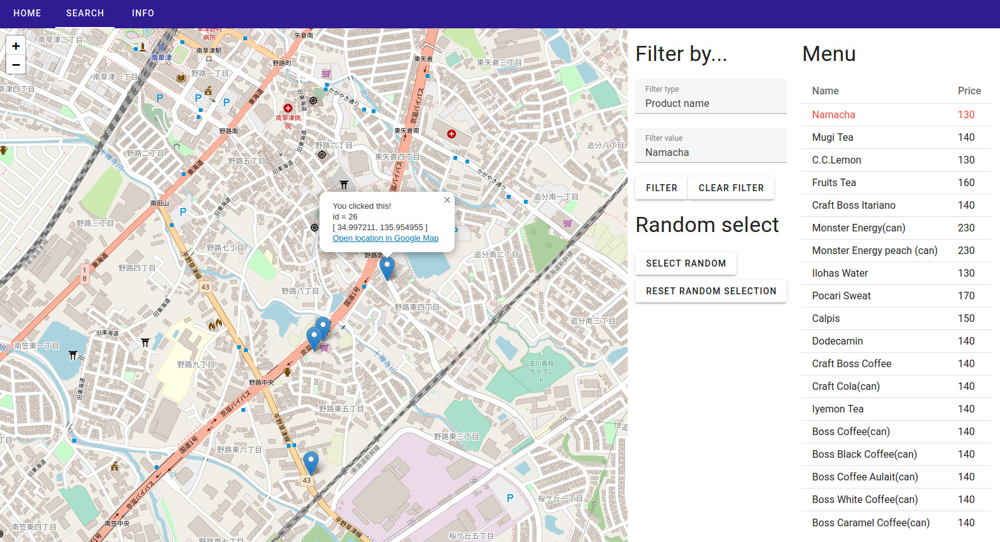

# pbl3-app

This is the source code of group I's demo application.

Here is a screenshot of the app.



## Setup

### Git clone this repo

```
git clone https://github.com/shutosheep/pbl3-app
cd pbl3-app/
```

### Run application using Docker

If you know docker you can start application with

```
docker-compose up
```

Access http://localhost:5173 and you should see the application.

### Run application without Docker

Below will explain how to setup without using docker.

#### Setup frontend

Make sure you have installed Node.js and `npm` command is avilable. \
I recommend installing Node.js with [nvm](https://github.com/nvm-sh/nvm).

```
cd frontend/
npm i
cd ..
```

#### Setup backend

```
cd backend/
python3 -m venv env
source env/bin/activate
pip install -r requirements.txt
deactivate
cd ..
```

#### Run the application

Open 2 terminals and run these commands

```
cd frontend/
npm run dev
```

```
cd backend/
source env/bin/activate
flask run
```

Access http://localhost:5173 and you should see the application.
